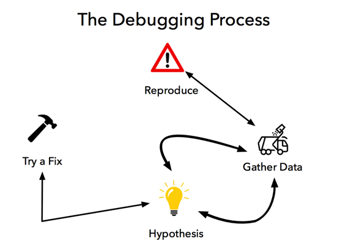
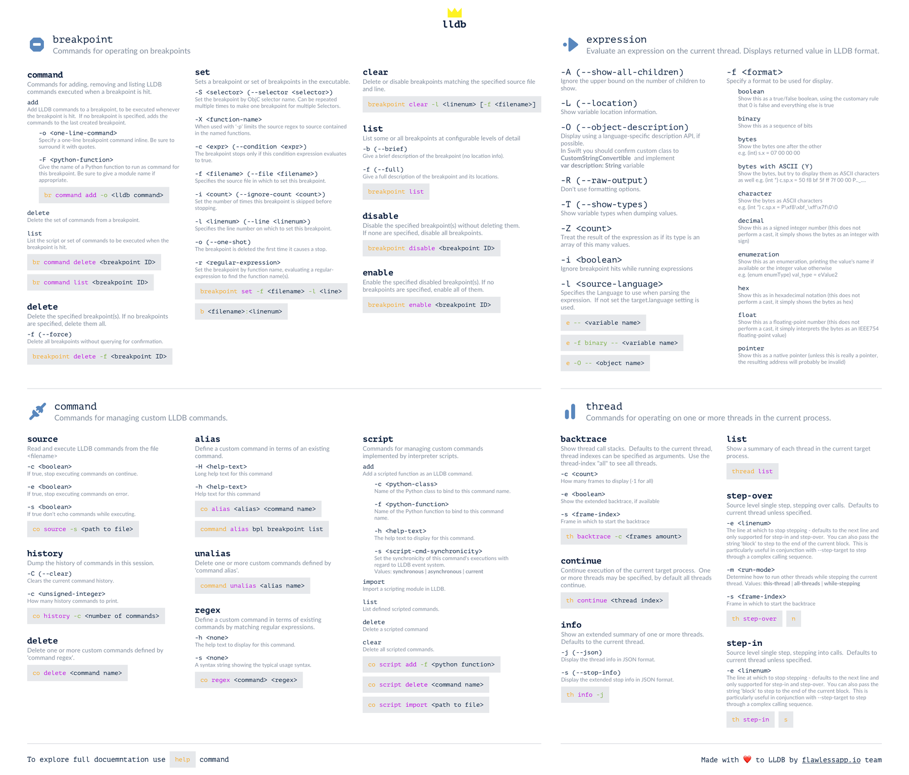

# Debugging Fun
## MME iOS Dev Teacher Meetup

* [Xcode Debugging Course - Udacity](https://www.udacity.com/course/xcode-debugging--ud774) (Free!)
* [Debugging Swift Code with LLDB](https://medium.com/flawless-app-stories/debugging-swift-code-with-lldb-b30c5cf2fd49) by Ahmed Sulaiman

```swift
@IBAction func unwindToRootViewController(_ sender:UIStoryboardSegue) {
	print("unwindToRootViewController")
}
```






